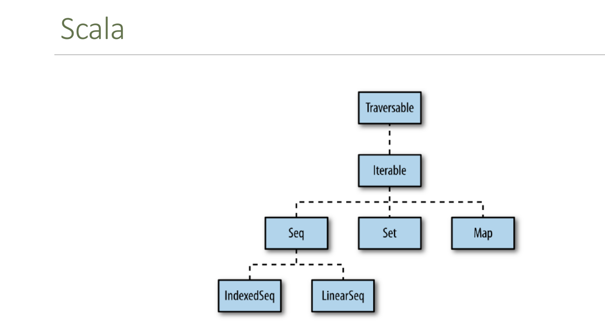
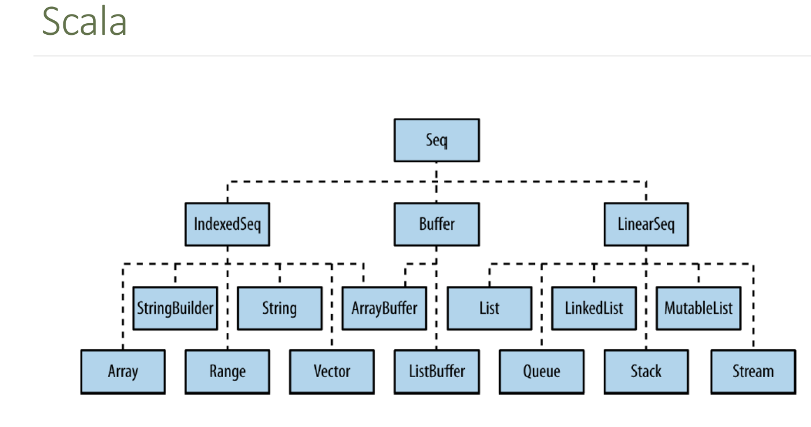
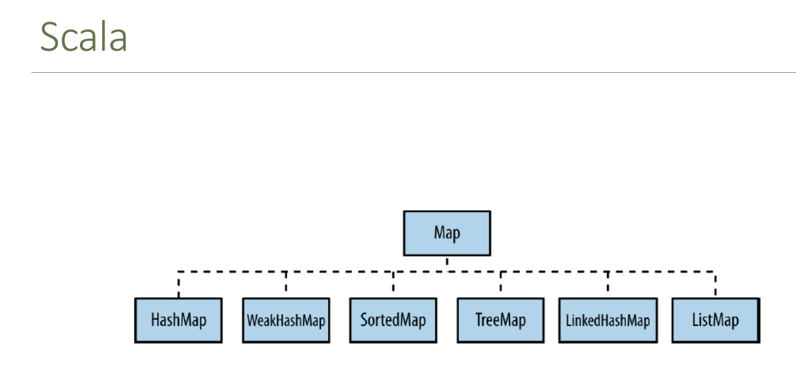
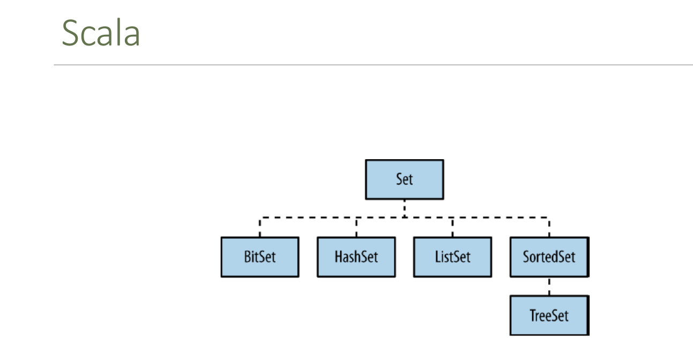

# 3-colecciones
1. [Introducción a las colecciones](#schema1)
2. [Colecciones Inmutables](#schema2)
3. [Colecciones Mutables](#schema3)
4. [Operaciones Comunes en Colecciones](#schema4)
5. [Array](#schema5)

<hr>

<a name="schema1"></a>

## 1. Introducción a las colecciones

Las colecciones en Scala son una parte fundamental del lenguaje y proporcionan estructuras de datos ricas y versátiles para almacenar y manipular grupos de elementos. Scala tiene una biblioteca de colecciones bien diseñada que incluye listas, conjuntos, mapas, vectores, entre otros. 







### **Tipos de Colecciones en Scala**
Las colecciones en Scala se dividen en dos categorías principales:

- Colecciones inmutables: Estas colecciones no pueden ser modificadas una vez creadas. La mayoría de las colecciones en Scala son inmutables por defecto.
- Colecciones mutables: Estas colecciones pueden ser modificadas después de su creación.

<hr>

<a name="schema2"></a>

## 2. Colecciones Inmutables


### **List (Lista)**
Las listas en Scala son inmutables y se implementan como listas enlazadas.

```scala
val fruits = List("apple", "banana", "cherry")
```
- Operaciones comunes:

```scala
val head = fruits.head          // "apple"
val tail = fruits.tail          // List("banana", "cherry")
val isEmpty = fruits.isEmpty    // false
val size = fruits.size          // 3
val newList = fruits :+ "date"  // List("apple", "banana", "cherry", "date")
```
- ** Añadir elementos**
```scala
var lista1=List(2,3)
lista1=lista1:+45
```
El código funciona porque estás creando una nueva lista al agregar el elemento 45 a la lista `lista1`. Aunque las listas en Scala son inmutables, esto no significa que no puedas crear nuevas listas con elementos adicionales o eliminados.

Cuando haces `lista1 = lista1 :+ 45`, estás creando una nueva lista que contiene todos los elementos de `lista1` más el elemento 45. La lista original `lista1` sigue siendo inmutable; simplemente estás asignando una nueva lista a la variable `lista1`. Este es un enfoque común en Scala y en otros lenguajes funcionales para trabajar con estructuras de datos inmutables.

### **Set (Conjunto)**
Los conjuntos son colecciones sin duplicados.

```scala
val fruitSet = Set("apple", "banana", "cherry")
```
- Operaciones comunes:

```scala
val containsApple = fruitSet.contains("apple")  // true
val newSet = fruitSet + "date"                  // Set("apple", "banana", "cherry", "date")
val anotherSet = fruitSet - "banana"            // Set("apple", "cherry")
```
### **Map (Mapa)**
Los mapas son colecciones de pares clave-valor.

```scala
val fruitPrices = Map("apple" -> 1.0, "banana" -> 0.5, "cherry" -> 2.0)
```
- Operaciones comunes:

```scala
val applePrice = fruitPrices("apple")            // 1.0
val containsBanana = fruitPrices.contains("banana")  // true
val updatedMap = fruitPrices + ("date" -> 1.5)   // Map("apple" -> 1.0, "banana" -> 0.5, "cherry" -> 2.0, "date" -> 1.5)
```
### **Vector (Vector)**
Los vectores son similares a las listas, pero están optimizados para el acceso rápido a elementos y operaciones de actualización.

```scala
val numbers = Vector(1, 2, 3, 4, 5)
```
<hr>

<a name="schema3"></a>

## 3. Colecciones Mutables

Scala también proporciona colecciones mutables, que pueden ser modificadas después de su creación. Estas se encuentran en el paquete scala.collection.mutable.

### **Mutable ListBuffer**
```scala
import scala.collection.mutable.ListBuffer

val buffer = ListBuffer(1, 2, 3)
buffer += 4            // ListBuffer(1, 2, 3, 4)
buffer -= 2            // ListBuffer(1, 3, 4)
```
- **Añadir Elementos:**

```scala
listBuffer += 4               // ListBuffer(1, 2, 3, 4)
listBuffer.append(5)          // ListBuffer(1, 2, 3, 4, 5)
listBuffer.prepend(0)         // ListBuffer(0, 1, 2, 3, 4, 5)
```
- **Eliminar Elementos:**

```scala
listBuffer -= 2               // ListBuffer(0, 1, 3, 4, 5)
listBuffer.remove(0)          // ListBuffer(1, 3, 4, 5)
```
- **Acceder a Elementos:**

```scala
val firstElement = listBuffer(0)  // 1
val lastElement = listBuffer.last // 5
```
- **Iterar sobre ListBuffer:**

```scala
for (element <- listBuffer) {
  println(element)
}
```

### **Mutable Set**
```scala
import scala.collection.mutable.Set

val mutableSet = Set("apple", "banana")
mutableSet += "cherry"       // Set("apple", "banana", "cherry")
mutableSet -= "banana"       // Set("apple", "cherry")
```
### **Mutable Map**
```scala
import scala.collection.mutable.Map

val mutableMap = Map("apple" -> 1.0, "banana" -> 0.5)
mutableMap("cherry") = 2.0      // Map("apple" -> 1.0, "banana" -> 0.5, "cherry" -> 2.0)
mutableMap -= "banana"          // Map("apple" -> 1.0, "cherry" -> 2.0)
```
<hr>

<a name="schema4"></a>

## 4. Operaciones Comunes en Colecciones
### **Transformaciones**
Puedes aplicar funciones a los elementos de una colección para transformarlos:

```scala
val numbers = List(1, 2, 3, 4, 5)
val doubled = numbers.map(_ * 2)  // List(2, 4, 6, 8, 10)
```
### **Filtrado**
Puedes filtrar elementos que cumplan una condición:

```scala
val evenNumbers = numbers.filter(_ % 2 == 0)  // List(2, 4)
```
### **Reducción**
Puedes combinar todos los elementos de una colección usando una operación:

```scala
val sum = numbers.reduce(_ + _)  // 15
```
### **Agrupamiento**
Puedes agrupar elementos según una clave:

```scala
val groupedByParity = numbers.groupBy(_ % 2)  // Map(1 -> List(1, 3, 5), 0 -> List(2,
```
<hr>

<a name="schema5"></a>

## 5. Array

Un array es una colección mutable que contiene un número fijo de elementos del mismo tipo. A diferencia de las listas, que son inmutables por defecto, los arrays en Scala son mutables, lo que significa que puedes modificar los elementos que contiene después de que se ha creado el array.

### **Creación de Arrays**
Puedes crear un array en Scala especificando el tipo de elementos que contendrá y proporcionando los valores iniciales:

```scala
val array1 = Array(1, 2, 3, 4, 5) // Crear un array de enteros
val array2 = Array("Hola", "Mundo") // Crear un array de cadenas
val array3 = Array.fill(5)(0) // Crear un array de tamaño 5 con todos los elementos inicializados a 0
```
También puedes especificar el tipo de elementos explícitamente:

```scala
val array: Array[Int] = Array(1, 2, 3)
```
### **Acceso a Elementos**
Puedes acceder a los elementos de un array utilizando su índice, que comienza en 0:

```scala
val primerElemento = array(0) // Acceder al primer elemento
val segundoElemento = array(1) // Acceder al segundo elemento
```
### **Modificación de Elementos**
Dado que los arrays son mutables, puedes modificar los elementos que contienen después de que se ha creado el array:

```scala
array(0) = 10 // Modificar el primer elemento a 10
array(1) = 20 // Modificar el segundo elemento a 20
```
### **Métodos Útiles**
Los arrays en Scala proporcionan una variedad de métodos útiles para trabajar con ellos, incluyendo:

- length: Devuelve el número de elementos en el array.
- foreach: Itera sobre todos los elementos del array y aplica una función a cada elemento.
- map, filter, reduce, etc.: Métodos de alto orden para transformar y manipular los elementos del array.
- toArray: Convierte una colección en un array.
### **Limitaciones**
Es importante tener en cuenta que los arrays en Scala tienen un tamaño fijo y que no pueden cambiar de tamaño dinámicamente. Si necesitas una colección mutable que pueda cambiar de tamaño, puedes usar `ArrayBuffer` del paquete `scala.collection.mutable`.